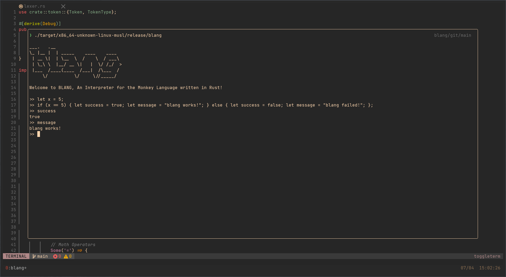

     
## Why?

Understanding how higher level languages work can lead to a deeper understanding and mastery of your toolkit. To get a better handle on how a simple language is interpreted by a machine, I am working on building an interpreter and compiler to implement the Monkey Toy Language in Rust.

### Where we're at

A repl for the Monkey Language is complete, with booleans, integers, and strings available, along with if/else statements, functions and closures.

#### Resources

Thanks to Thorsten Ball, and his book: https://interpreterbook.com/, this is where the Monkey language originally comes from.
Additional thanks to https://craftinginterpreters.com/, which was a valuable resource throughout this project.
